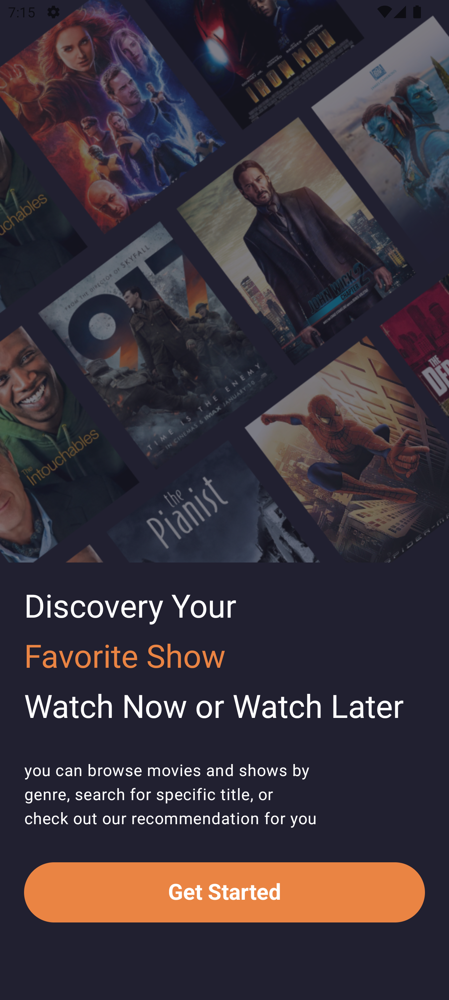
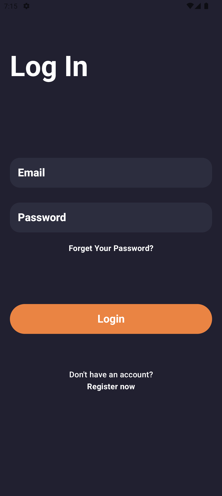
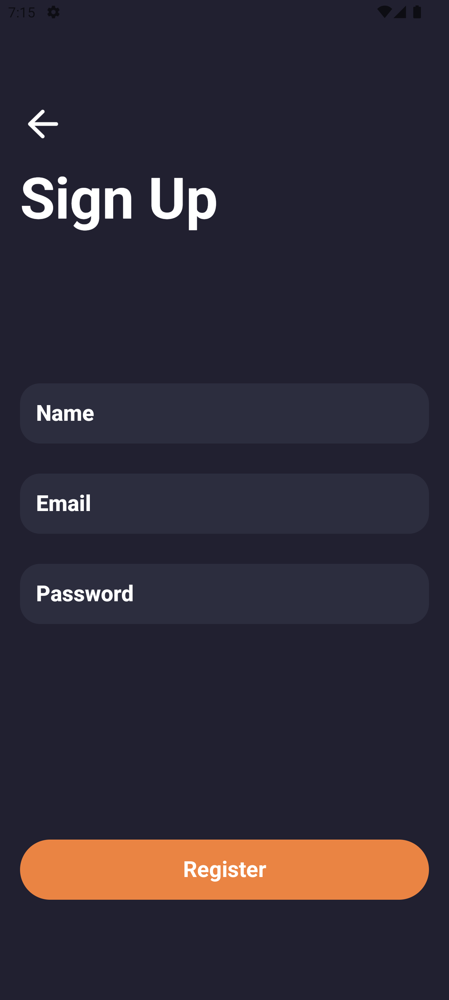
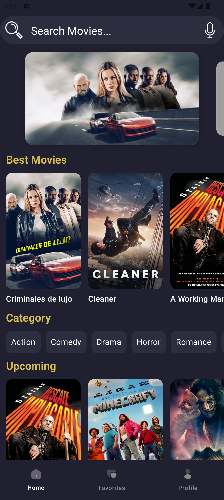
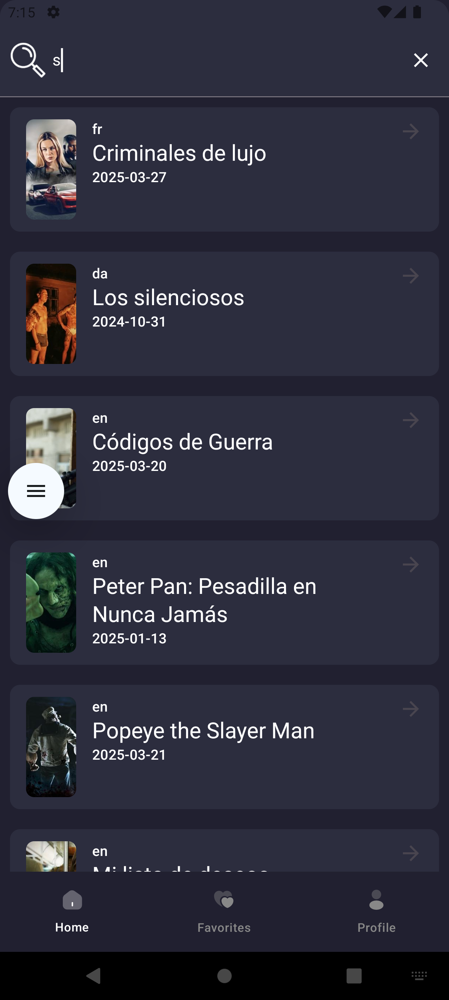
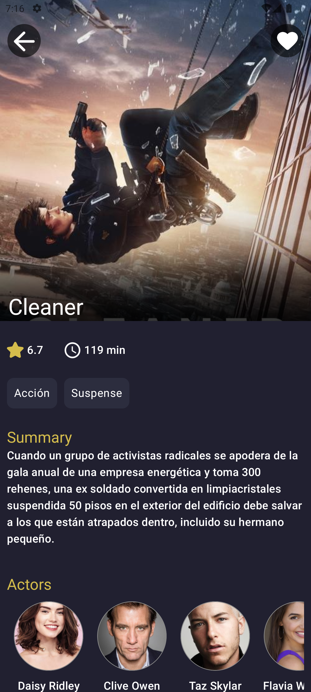
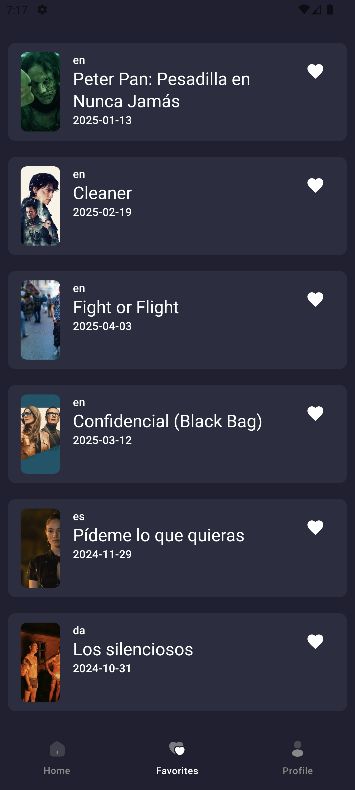

# 🎬 MovieApp

MovieApp es una aplicación desarrollada con **Jetpack Compose y Kotlin**, que permite explorar las últimas películas y gestionar una lista de favoritos. Utiliza **Firebase Authentication** para la autenticación de usuarios y **Firestore** para almacenar las películas favoritas.

## 🚀 Características principales

✅ Registro e inicio de sesión con **Firebase Authentication** 🔑  
✅ Guardado de películas favoritas en **Firestore** 🔥  
✅ Búsqueda dinámica con **SearchBar** 🎯  
✅ Consumo de la API de **TheMovieDB** para obtener información en tiempo real 🌍  
✅ **DataStore** para almacenar preferencias del usuario ⚙️  
✅ Arquitectura basada en **Clean Architecture y MVVM** 📂  
✅ Uso de **Hilt** para la inyección de dependencias 🏗️  
✅ Diseño moderno y fluido con **Jetpack Compose** 🎨

## 🏗️ Arquitectura
MovieApp sigue una arquitectura **Clean Architecture** con **MVVM** para garantizar un código modular y escalable. Se estructura en los siguientes módulos:

- **Data Layer**: Contiene los modelos, repositorios e implementación de las fuentes de datos (API y Firestore).
- **Domain Layer**: Contiene los casos de uso (Use Cases) y la lógica de negocio.
- **Presentation Layer**: Contiene los ViewModels y la UI construida con Jetpack Compose.

## 🔧 Tecnologías y herramientas utilizadas

- **Jetpack Compose** - Para la UI declarativa
- **Kotlin** - Lenguaje de programación
- **Firebase Authentication** - Autenticación de usuarios
- **Firestore** - Base de datos para almacenar favoritos
- **Retrofit** - Consumo de API de TheMovieDB
- **Hilt** - Inyección de dependencias
- **DataStore** - Persistencia de datos de usuario
- **Coroutines & Flow** - Programación asíncrona
- **Navigation Component** - Manejo de navegación en Compose

## 📸 Capturas de pantalla

<p align="center">
  
  
  
</p>

<p align="center">
  
  
  
  

</p>


## 📦 Instalación y configuración

1. Clona este repositorio:
   ```sh
   git clone https://github.com/JeanDeveloper/movie_app.git
   ```
2. Abre el proyecto en Android Studio.
3. Configura tu archivo `google-services.json` para Firebase.
4. Obtén una clave de API de [TheMovieDB](https://www.themoviedb.org/) y configúrala en `local.properties`:
   ```properties
   APY_KEY=tu_api_key
   ```
5. Ejecuta la aplicación en un emulador o dispositivo real.

## 🚀 Contribuciones
Si deseas contribuir, ¡siempre son bienvenidas las mejoras y sugerencias! Haz un **fork**, crea una **rama** y envía un **pull request**. 😃

## 📄 Licencia
Este proyecto está bajo la licencia MIT. Puedes ver más detalles en el archivo `LICENSE`.

---
💡 **MovieApp** es un proyecto que refleja mi pasión por el desarrollo móvil y la arquitectura de software. ¡Espero que te guste! 😊
